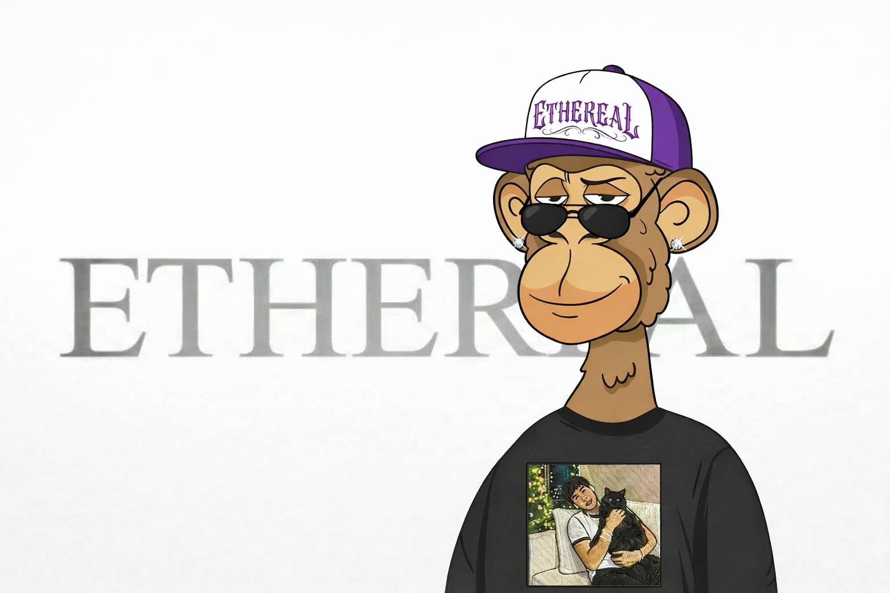

  <h1 style="font-weight: 800; font-size: 36px; letter-spacing: 2px;">Abraham Nicolas</h1>
  
  

  

  
  
  
  
  
  
  
  
  
  
  
  
  
  
  
  
  
  
  
  
  
  
  
  
  
  
  
  
  

 

  
  
  
  

 

  <picture>
    <source media="(prefers-color-scheme: dark)" srcset="https://raw.githubusercontent.com/AbrahmNicolas/AbrahmNicolas/output/pacman-contribution-graph-dark.svg">
    <source media="(prefers-color-scheme: light)" srcset="https://raw.githubusercontent.com/AbrahmNicolas/AbrahmNicolas/output/pacman-contribution-graph.svg">
    
  </picture>

 

  

  

<h6 align="center" style="color: #888888; font-size: 14px; font-weight: 600;">© ETHEREAL</h6>
